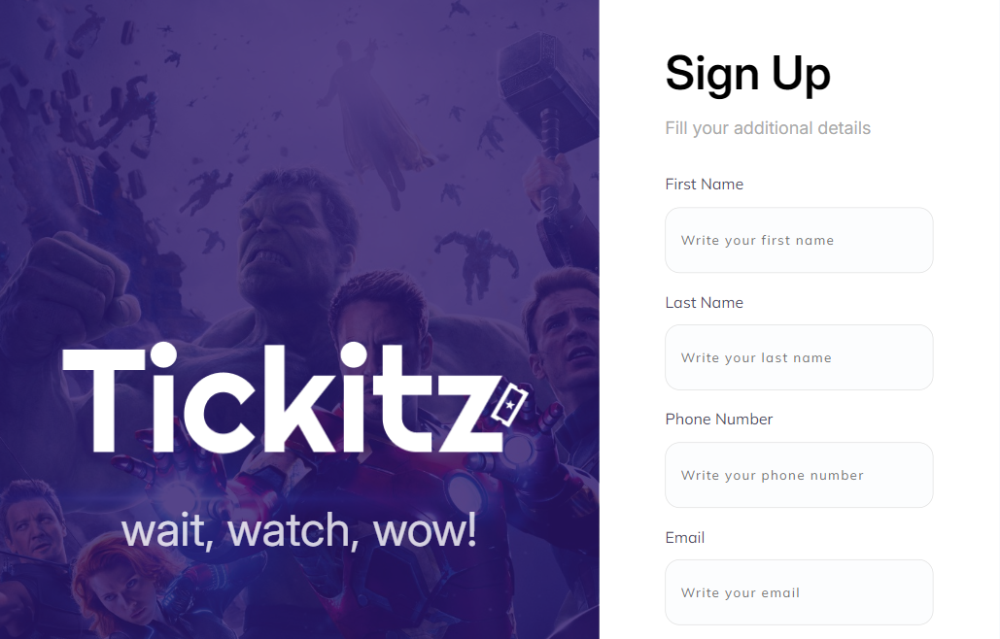
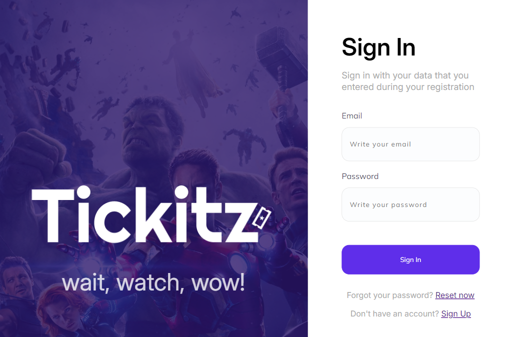
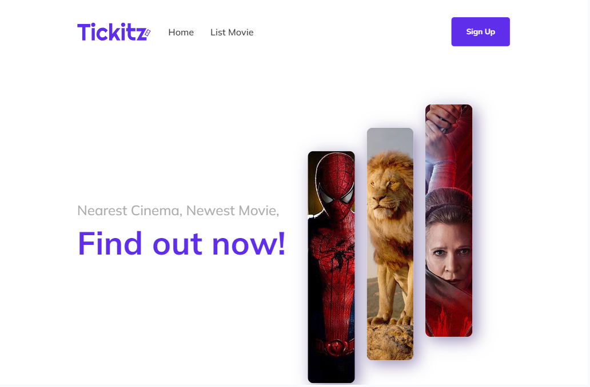

# HTML dan CSS

Project ini merupakan pengenalan terhadap materi HTML dan CSS dengan slicing tampilan website Tickitz, yang diaplikasikan dalam beberapa file tugas <br>

## Usage
Untuk menggunakan project ini, hal yang harus dilakukan:<br>

1. Clone the Repository:
   ```bash 
   git clone https://github.com/raissarahmani/jsdom.git
   ```

2. Navigate to Project Directory:
    ```bash 
   cd jsdom
   ```

3. Open the file: <br>
    -Buka file dari Visual Studio Code <br>
    -Install extension *Live Server* jika belum terinstall. Klik kanan pada nama file di kolom bagian kiri, klik *open with Live Server* <br>
    -File akan terbuka pada halaman browser<br>

4. The Output:<br>
    -Dalam project ini, terdapat 6 file utama yang terdiri dari file html dan css, serta beberapa file gambar dan icon sebagai file pendukung<br>

    **signup.html**: File HTML sebagai struktur halaman Sign Up<br>
    **stylesheet.css**: File CSS yang berfungsi untuk mengatur tampilan Sign Up. Beberapa hal yang diatur dalam file ini yaitu font, box sizing, background, flex <br> <br>
    *Preview Halaman Sign Up* <br>
     

    **signin.html**: File HTML sebagai struktur halaman Sign In <br> 
    **stylesheet2.css**: File CSS yang berfungsi untuk mengatur tampilan Sign In. Beberapa hal yang diatur dalam file ini yaitu font, box sizing, background, flex <br> <br>
    *Preview Halaman Sign In* <br>
     
    
    **home.html**: File HTML sebagai struktur halaman Home<br>
    **stylesheet3.css**: File CSS yang berfungsi untuk mengatur tampilan Home. Beberapa hal yang diatur dalam file ini yaitu font, box sizing, background, flex, overflow <br> <br>
    *Preview Halaman Home* <br>
     

    -Halaman web di atas juga telah didesain agar responsif terhadap layar pengguna. Ukuran responsive yang diterapkan yaitu berdasarkan layar HP dan Laptop
    

## Contact
Created by [Raissa Rahmani](raissarahmani18@gmail.com) - feel free to contact me!